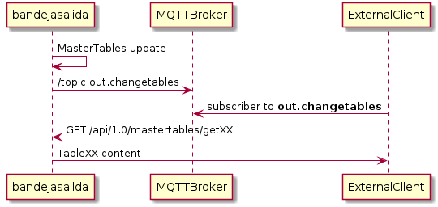
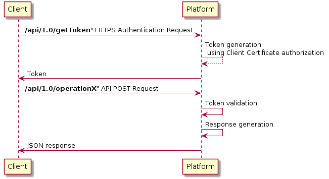

## **Autor**

| Empresa | Fecha | Versión |
|:-:|:-:|:-:|
|   | 12/03/2019 | 2.0 |

## **Ponente**


| Imagen  |  Nombre |  Empresa |Cargo|email|Linkedin|
|:-:|:-:|:-:|:-:|:-:|:-:|
|   | José Gómez Castaño  |    | **CTO** | jgcasta@inspide.com 	| [linkedin.com/in/josegomezcastano](https://linkedin.com/in/josegomezcastano) |

## Contacto de Soporte

Para solventar cualquier duda o incidencia se ha abierto un buzón de correo en el que se atenderán estas

soporte@cmobility30.es

# **Índice**

1. [Información de práctica](#id1)
	1. [Generación automática del cliente](#id1.1)
2. [Ejercicios prácticos](#id2)
	1. [Identificación en el servicio](#id21)
	2. [Solicitud de PMVs anidados](#id22)
	3. [Solicitud de PMVs en una Provincia](#id23)
	4. [Solicitud de PMVs de un Tipo](#id24)
	5. [Solicitud de PMVs de una carretera](#id25)
	6. [Solicitud de PMVs de una carretera entre dos puntos kilométricos](#id26)
	7. [Solicitud de PMVs en función del sentido de circulación](#id27)
	8. [Solicitud de PMVs en función del modo de transporte](#id28)
	9. [Solicitud de PMVs en función de la categoría del evento](#id29)
	10. [Solicitud de PMVs sin geometría, sólo valores alfanuméricos](#id210)

# Información **práctica** <a name="id1"></a>

 **Documentación del API Bandeja de Salida**


La información del API de la **Bandeja de Salida** se encuentra en las siguientes urls: [Apiary](https://bandejasalida.docs.apiary.io) (Acceso libre) y  [Swagger](https://bandejadesalida-dev.cmobility30.es:8443/swagger-ui.html) (requerido certificado)

 **Herramientas**


Para la ejecución de las pruebas es necesario el uso de un Cliente REST. Se propone la *descarga* de [Postman](https://www.getpostman.com/downloads/) como cliente para el seguimiento del workshop.

 **Diagrama de secuencia**


## *1.1* Generación automática de un cliente <a name="id1.1"></a>

Al estar basado en SWAGGER la publicación del API, es posible utilizar la utilidad [swagger-codegen-cli](https://search.maven.org/classic/#search%7Cgav%7C1%7Cg%3A%22io.swagger%22%20AND%20a%3A%22swagger-codegen-cli%22) para generar una aplicación completa, a partir del fichero JSON obtenido de la descarga https://bandejadesalida-dev.cmobility30.es:8443/v2/api-docs (requerido certificado)

Teniendo la utilidad en el mismo directorio que el fichero api-docs.json hay que ejecutar el comando.

```sh
java -jar swagger-codegen-cli-2.4.1.jar generate \
  -i bandejadesalida_1.0.json \
  --api-package es.xxxxxx.dgt30.bandejasalida.client.api \
  --model-package es.xxxxxx.dgt30.bandejasalida.client.model \
  --invoker-package es.xxxxxx.dgt30.bandejasalida.client.invoker \
  --group-id es.xxxxxx \
  --artifact-id es.xxxxxx.dgt30.bandejasalida \
  --artifact-version 0.0.1-SNAPSHOT \
  -l java \
  --library resttemplate \
  -o DGT30BandejaSalidaClient
```


## *00.* - Tablas maestras <a name="id21"></a>

Para el filtrado de la información de los PMVV activos en cada momento, es necesario enviar un JSON con los atributos de filtrado, que responde al siguiente ejemplo

```json
{
  "idcompany": "INSPIDE",
  "token": "28a9e96167a6ee0f84bb9c46e8a3b381032f7d9de59ce882539db044e4ee691f",
  "type": 0,
  "province": 28,
  "road": "A2",
  "kpfrom": 2,
  "kpto": 50,
  "direction": 3,
  "mode": 3,
  "category": 3,
  "withgeom": 1
}
```

Los atributos están codificados y pueden consultarse invocando al método GET de la tabla maestra correspondiente. Estas están constantemente actualizadas en https://bandejadesalida-dev.cmobility30.es:8443/swagger-ui.html

## Cambios en las tablas Maestras

Los cambios en alguna de las tablas es notificado mediante un mensaje MQTT al tópico **out.changetables** según el siguiente diagrama de secuencia



```json
{
    "code": 1,
    "data": [],
    "desc": "MasterTables have a change"
}
```

En estes caso, o cuando se desee, se puede consultar la últmia actaulilzación de las mismas para solicitar su contenido, mediante el método  **/api/1.0/mastertables/getChangeTables** , lo que devuelve el siguiente mensaje

```json
{
  "errorCode": 0,
  "errorDesc": "OK",
  "data": [
    {
      "idchange": 1,
      "tschange": "2019-02-20T05:00:00.000+0000",
      "tablename": "Categories"
    },
    {
      "idchange": 2,
      "tschange": "2019-02-20T01:00:00.000+0000",
      "tablename": "ErrorCodes"
    }
	]
}
```


# Ejercicios **prácticos** <a name="id2"></a>

## *01.* - Identificación en el servicio <a name="id21"></a>

Ejemplo **a | Identificación correcta**

Para llevar a cabo las operaciones del API es necesario obtener un token de sesión que caducará de forma aleatoria a lo largo de la misma. La operación que permite obtenerlo es **/api/1.0/getToken** que devuelve el siguiente resultado:



```json
{
  "errorCode": 0,
  "errorDesc": "OK",
  "data": [
    {
      "token": "28a9e96167a6ee0f84bb9c46e8a3b381032f7d9de59ce882539db044e4ee691f"
    }
  ]
}
```
El proceso de autenticación está basado en certificados digitales de cliente. Para la realización de pruebas y posterior pase a producción, el cliente deberá cumplimentar la documentación proporcionada en la que se le solicitan los datos necesarios de la empresa que vaya a consumir los servicios. El certificado será emitido por la PKI de la plataforma y entregado físicamente al responsable del mismo.

> 		**Explicación**
>
> Se trata de una identificación correcta gracias a la introducción de los valores `token`e`idcompany`. El token es el proporcionado temporalmente por el servicio, e idcompany corresponde al campo CN del certificado digital de cliente.
>

Ejemplo **b | Solicitud correcta**
```json
{
    "category": 15,
    "idcompany": "cn.correcto",
    "token": "token.correcto",
    "withgeom": 1
}
```

Si la identifiación es errónea, se obtiene el siguiente mensaje
```json
{
    "errorCode": 10,
    "errorDesc": "Authorization error",
    "data": []
}
```

Ejemplo **c | Solicitud incorrecta por `idcompany`**


> 		**Explicación**
>
> No se proporciona `idcompany` válido.
>
> - Código de Error: **10**
> - Descripción del error: **Authorization error**
>

``` json
	{
	"idcompany": "cn.erroneo",
	"token": "token.correcto",
	"category": 15,
	"withgeom":1
	}
```

Ejemplo **d | Solicitud incorrecta por `token`**

> 	**Explicación**
>
> No se proporciona `token` válido.
>
> - Código de Error: **10**
> - Descripción del error: **Authorization error**
>

``` json
	{
	"idcompany": "cn.correcto",
	"token": "token.erroneo",
	"category": 15,
	"withgeom":1
	}
```

Ejemplo **e | Solicitud incorrecta por `token` e `idcompany`**

> 	**Explicación**
>
> Se trata de una identificación errónea debido a que se ha introducido el valor `token` así como el valor `idcompany` incorrectamente.
>
> - Código de Error: **10**
> - Descripción del error: **Authorization error**
>

``` json
	{
	"idcompany": "cn.erroneo",
	"token": "token.erroneo",
	"category": 15,
	"withgeom":1
	}
```


## *02.* - Solicitud de PMVs anidados <a name="id22"></a>

Ejemplo **a | Solicitud correcta**

> 	**Explicación**
>
> Solicitud correcta de la información alfanumérica y geográfica (`withgeom`) del conjunto de Paneles de Mensaje Virtual según los
> siguientes atributos: `type`,`province`,`road`, `kpfrom`,`kpto`,`direction`,`mode`,`category` que se indican en la siguiente Tabla:
>
> |  Tipo |  Provincia  | Carretera  | PK inicio  | PK final | Dirección | Modo | Categoría | Geometrías |
> |:-:|:-:|:-:|:-:|:-:|:-:|:-:|:-:|:-:|
> |  **Punto** |  **Madrid** | **A-2** |  **2** |	**40** |  **Ambos** |  **Ciclomotor / Motocicleta** | **Calidad del aire**  | **Sí** |
>

```json
	{
	"idcompany": "INSPIDE",
	"token": "28a9e96167a6ee0f84bb9c46e8a3b381032f7d9de59ce882539db044e4ee691f",
	"type": 1,
	"province": 28,
	"road": "A-2",
	"kpfrom": 2,
	"kpto": 40,
	"direction":1,
	"mode": 3,
	"category": 15,
	"withgeom":1
	}
```

## *03.* - Solicitud de PMVs en una Provincia <a name="id23"></a>

Ejemplo **a | Solicitud correcta**

> 	**Explicación**
>
> Solicitud correcta de la información alfanumérica y geográfica (`withgeom`) del conjunto de Paneles de Mensaje Virtual según los
> siguientes atributos: `province` que se indican en la siguiente Tabla:
>
> |  Tipo |  Provincia  | Carretera  | PK inicio  | PK final | Dirección | Modo | Categoría | Geometrías |
> |:-:|:-:|:-:|:-:|:-:|:-:|:-:|:-:|:-:|
> |  na |  **Madrid** | na |  na |	na |  na |  na | na | **Sí** |
>

```json
	{
	"idcompany": "INSPIDE",
	"token": "28a9e96167a6ee0f84bb9c46e8a3b381032f7d9de59ce882539db044e4ee691f",
	"province": 28,
	"withgeom":1
	}
```

Ejemplo **b | Solicitud incorrecta por `province`**

> 	**Explicación**
>
> Se trata de una solicitud errónea debido a que se ha introducido el valor `province` incorrectamente ya que no es un valor *integer*.
>
> - Código de Error: **3**
> - Descripción del error: **Province must be an integer value**
>

```json
	{
	"idcompany": "INSPIDE",
	"token": "28a9e96167a6ee0f84bb9c46e8a3b381032f7d9de59ce882539db044e4ee691f",
	"province": "Texto",
	"withgeom":1
	}
```

## *04.* - Solicitud de PMVs de un Tipo <a name="id24"></a>


Ejemplo **a | Solicitud correcta**

> 	**Explicación**
>
> Solicitud correcta de la información alfanumérica y geográfica (`withgeom`) del conjunto de Paneles de Mensaje Virtual según los
> siguientes atributos: `type` que se indican en la siguiente Tabla:
>
> |  Tipo |  Provincia  | Carretera  | PK inicio  | PK final | Dirección | Modo | Categoría | Geometrías |
> |:-:|:-:|:-:|:-:|:-:|:-:|:-:|:-:|:-:|
> |  **Punto** |  na | na |  na |	na |  na |  na | na | **Sí** |
>

```json
	{
	"idcompany": "INSPIDE",
	"token": "28a9e96167a6ee0f84bb9c46e8a3b381032f7d9de59ce882539db044e4ee691f",
	"type": 1,
	"withgeom":1
	}
```

Ejemplo **b | Solicitud incorrecta por `type`**

> 	**Explicación**
>
> Se trata de una solicitud errónea debido a que se ha introducido el valor `type` incorrectamente ya que no es un valor *válido*.
>
> - Código de Error: **9**
> - Descripción del error: **Type is not valid**
>

```json
	{
	"idcompany": "INSPIDE",
	"token": "28a9e96167a6ee0f84bb9c46e8a3b381032f7d9de59ce882539db044e4ee691f",
	"type": 1000,
	"withgeom":1
	}
```

Ejemplo **c | Solicitud incorrecta por `type`**

> 	**Explicación**
>
> Se trata de una solicitud errónea debido a que se ha introducido el valor `type` incorrectamente ya que no es un valor *integer*.
>
> - Código de Error: **9**
> - Descripción del error: **Type must be an integer value**
>

```json
	{
	"idcompany": "INSPIDE",
	"token": "28a9e96167a6ee0f84bb9c46e8a3b381032f7d9de59ce882539db044e4ee691f",
	"type": "Texto",
	"withgeom":1
	}
```

## *05.* - Solicitud de PMVs de una carretera <a name="id25"></a>

Ejemplo **a | Solicitud correcta**

> 	**Explicación**
>
> Solicitud correcta de la información alfanumérica y geográfica (`withgeom`) del conjunto de Paneles de Mensaje Virtual según los
> siguientes atributos: `province` y `road` que se indican en la siguiente Tabla:
>
> |  Tipo |  Provincia  | Carretera  | PK inicio  | PK final | Dirección | Modo | Categoría | Geometrías |
> |:-:|:-:|:-:|:-:|:-:|:-:|:-:|:-:|:-:|
> |  na |  **Madrid** | A-2 |  na |	na |  na |  na | na | **Sí** |
>

```json
	{
	"idcompany": "INSPIDE",
	"token": "28a9e96167a6ee0f84bb9c46e8a3b381032f7d9de59ce882539db044e4ee691f",
	"province": 28,
	"road": "A-2",
	"withgeom":1
	}
```

Ejemplo **b | Solicitud correcta**

> 	**Explicación**
>
> Solicitud correcta de la información alfanumérica y geográfica (`withgeom`) del conjunto de Paneles de Mensaje Virtual según los
> siguientes atributos: `province` y `road` que se indican en la siguiente Tabla:
>
> |  Tipo |  Provincia  | Carretera  | PK inicio  | PK final | Dirección | Modo | Categoría | Geometrías |
> |:-:|:-:|:-:|:-:|:-:|:-:|:-:|:-:|:-:|
> |  na |  **Madrid** | **A-2** |  na |	na |  na |  na | na | **Sí** |
>
>
> **Nota**
>
> El valor ‘0’ en el atributo “pmvProv” indica que se trata de PMV tipo área que intersecta con la Provincia solicitada (en este caso 28).
> Es debido a la información asociada a un PMV tipo área, no contienen la Provincia.
>


```json
	{
	"idcompany": "INSPIDE",
	"token": "28a9e96167a6ee0f84bb9c46e8a3b381032f7d9de59ce882539db044e4ee691f",
	"province": 28,
	"road": 10000,
	"withgeom":1
	}
```

Ejemplo **c | Solicitud correcta**

> 	**Explicación**
>
> Solicitud correcta de la información alfanumérica y geográfica (`withgeom`) del conjunto de Paneles de Mensaje Virtual según los
> siguientes atributos: `province` y `road` que se indican en la siguiente Tabla:
>
> |  Tipo |  Provincia  | Carretera  | PK inicio  | PK final | Dirección | Modo | Categoría | Geometrías |
> |:-:|:-:|:-:|:-:|:-:|:-:|:-:|:-:|:-:|
> |  na |  **Madrid** | **A-2** |  na |	na |  na |  na | na | **Sí** |
>
>
> **Nota**
>
> El valor ‘0’ en el atributo “pmvProv” indica que se trata de PMV tipo área que intersecta con la Provincia solicitada (en este caso 28).
> Es debido a la información asociada a un PMV tipo área, no contienen la Provincia.
>

```json

	{
	"idcompany": "INSPIDE",
	"token": "28a9e96167a6ee0f84bb9c46e8a3b381032f7d9de59ce882539db044e4ee691f",
	"province": 28,
	"road": "Texto",
	"withgeom":1
	}
```

## *06.* - Solicitud de PMVs de una carretera entre dos puntos kilométricos <a name="id26"></a>


Ejemplo **a | Solicitud correcta**

> 	**Explicación**
>
> Solicitud correcta de la información alfanumérica y geográfica (`withgeom`) del conjunto de Paneles de Mensaje Virtual según los
> siguientes atributos: `province`,`road`,`kpfrom`,`kpto` que se indican en la siguiente Tabla:
>
> |  Tipo |  Provincia  | Carretera  | PK inicio  | PK final | Dirección | Modo | Categoría | Geometrías |
> |:-:|:-:|:-:|:-:|:-:|:-:|:-:|:-:|:-:|
> |  na |  **Madrid** | **A-2** |  **2** | **40** |  na |  na | na | **Sí** |
>

```json
	{
	"idcompany": "INSPIDE",
	"token": "28a9e96167a6ee0f84bb9c46e8a3b381032f7d9de59ce882539db044e4ee691f",
	"province":28,
	"road": "A-2",
	"kpfrom": 2,
	"kpto": 40,
	"withgeom":1
	}
```

Ejemplo **b | Solicitud incorrecta por `kpfrom` menor a `kpto`**

> 	**Explicación**
>
> Se trata de una solicitud errónea debido a que se ha introducido de forma incoherente los valores
> del Punto kilométrico inicial y Punto kilométrico final siendo `kpto`  > `kpfrom`
>
> - Código de Error: **5**
> - Descripción del error: **Kp from must be lower than Kp to**
>

```json
	{
	"idcompany": "INSPIDE",
	"token": "28a9e96167a6ee0f84bb9c46e8a3b381032f7d9de59ce882539db044e4ee691f",
	"province":28,
	"road": "A-2",
	"kpfrom": 40,
	"kpto": 2,
	"withgeom":1
	}
```


## *07.* - Solicitud de PMVs en función del sentido de circulación <a name="id27"></a>

Ejemplo **a | Solicitud correcta**

> 	**Explicación**
>
> Solicitud correcta de la información alfanumérica y geográfica (`withgeom`) del conjunto de Paneles de Mensaje Virtual según los
> siguientes atributos: `direction` que se indican en la siguiente Tabla:
>
> |  Tipo |  Provincia  | Carretera  | PK inicio  | PK final | Dirección | Modo | Categoría | Geometrías |
> |:-:|:-:|:-:|:-:|:-:|:-:|:-:|:-:|:-:|
> |  na |  na | na |  na |	na |  **Ambos** |  na | na | **Sí** |
>


```json
	{
	"idcompany": "INSPIDE",
	"token": "28a9e96167a6ee0f84bb9c46e8a3b381032f7d9de59ce882539db044e4ee691f",
	"direction":1,
	"withgeom":1
	}
```

Ejemplo **b | Solicitud correcta**

> 	**Explicación**
>
> Solicitud correcta de la información alfanumérica y geográfica (`withgeom`) del conjunto de Paneles de Mensaje Virtual según los
> siguientes atributos: `direction` que se indican en la siguiente Tabla:
>
> |  Tipo |  Provincia  | Carretera  | PK inicio  | PK final | Dirección | Modo | Categoría | Geometrías |
> |:-:|:-:|:-:|:-:|:-:|:-:|:-:|:-:|:-:|
> |  na |  na | na |  na |	na |  **Ambos** |  na | na | **Sí** |
>
>
> **Nota**
>
> No existe el valor de direction 1000, luego no existen PMVs que coincidan con los criterios de búsqueda.
>

```json
	{
	"idcompany": "INSPIDE",
	"token": "28a9e96167a6ee0f84bb9c46e8a3b381032f7d9de59ce882539db044e4ee691f",
	"direction": 10000,
	"withgeom":1
	}
```

Ejemplo **c | Solicitud incorrecta por `direction`**

> 	**Explicación**
>
> Se trata de una solicitud errónea debido a que se ha introducido el valor `direction` incorrectamente ya que no es un valor *integer*.
>
> - Código de Error: **7**
> - Descripción del error: **Direction must be an integer value**
>

```json
	{
	"idcompany": "INSPIDE",
	"token": "28a9e96167a6ee0f84bb9c46e8a3b381032f7d9de59ce882539db044e4ee691f",
	"direction": "Texto",
	"withgeom":1
	}
```


## *08.* - Solicitud de PMVs en función del modo de transporte <a name="id28"></a>

Ejemplo **a | Solicitud correcta**

> 	**Explicación**
>
> Solicitud correcta de la información alfanumérica y geográfica (`withgeom`) del conjunto de Paneles de Mensaje Virtual según los
> siguientes atributos: `mode` que se indican en la siguiente Tabla:
>
> |  Tipo |  Provincia  | Carretera  | PK inicio  | PK final | Dirección | Modo | Categoría | Geometrías |
> |:-:|:-:|:-:|:-:|:-:|:-:|:-:|:-:|:-:|
> |  na |  na | na |  na |	na |  na |  **Bicicleta** | na | **Sí** |
>

```json
	{
	"idcompany": "INSPIDE",
	"token": "28a9e96167a6ee0f84bb9c46e8a3b381032f7d9de59ce882539db044e4ee691f",
	"mode": 3,
	"withgeom":1
	}
```

Ejemplo **b | Solicitud correcta**

> 	**Explicación**
>
> Solicitud correcta de la información alfanumérica y geográfica (`withgeom`) del conjunto de Paneles de Mensaje Virtual según los
> siguientes atributos: `mode` que se indican en la siguiente Tabla:
>
> |  Tipo |  Provincia  | Carretera  | PK inicio  | PK final | Dirección | Modo | Categoría | Geometrías |
> |:-:|:-:|:-:|:-:|:-:|:-:|:-:|:-:|:-:|
> |  na |  na | na |  na |	na |  na |  **Bicicleta** | na | **Sí** |
>
>
> **Nota**
>
> No existe el valor de mode 1000, luego no existen PMVs que coincidan con los criterios de búsqueda.
>

```json
	{
	"idcompany": "INSPIDE",
	"token": "28a9e96167a6ee0f84bb9c46e8a3b381032f7d9de59ce882539db044e4ee691f",
	"mode": 1000,
	"withgeom":1
	}
```

Ejemplo **c | Solicitud correcta**

> 	**Explicación**
>
> Solicitud correcta de la información alfanumérica y geográfica (`withgeom`) del conjunto de Paneles de Mensaje Virtual según los
> siguientes atributos: `mode` que se indican en la siguiente Tabla:
>
> |  Tipo |  Provincia  | Carretera  | PK inicio  | PK final | Dirección | Modo | Categoría | Geometrías |
> |:-:|:-:|:-:|:-:|:-:|:-:|:-:|:-:|:-:|
> |  na |  na | na |  na |	na |  na |  **Bicicleta** | na | **Sí** |
>
>
> **Nota**
>
> La consulta es válida en todos los campos, luego si existen PMVs que coincidan con los criterios de búsqueda, aparecerán dentro del array data.
>

```json
	{
	"idcompany": "INSPIDE",
	"token": "28a9e96167a6ee0f84bb9c46e8a3b381032f7d9de59ce882539db044e4ee691f",
	"mode": "10",
	"withgeom":1
	}
```


## *09.* - Solicitud de PMVs en función de la categoría del evento <a name="id29"></a>

Ejemplo **a | Solicitud correcta**

> 	**Explicación**
>
> Solicitud correcta de la información alfanumérica y geográfica (`withgeom`) del conjunto de Paneles de Mensaje Virtual según los
> siguientes atributos: `category` que se indican en la siguiente Tabla:
>
> |  Tipo |  Provincia  | Carretera  | PK inicio  | PK final | Dirección | Modo | Categoría | Geometrías |
> |:-:|:-:|:-:|:-:|:-:|:-:|:-:|:-:|:-:|
> |  na |  na | na |  na |	na |  na |  na | **Calidad del aire** | **Sí** |
>

```json
	{
	"idcompany": "INSPIDE",
	"token": "28a9e96167a6ee0f84bb9c46e8a3b381032f7d9de59ce882539db044e4ee691f",
	"category": 15,
	"withgeom":1
	}
```

Ejemplo **b | Solicitud correcta**

> 	**Explicación**
>
> Solicitud correcta de la información alfanumérica y geográfica (`withgeom`) del conjunto de Paneles de Mensaje Virtual según los
> siguientes atributos: `category` que se indican en la siguiente Tabla:
>
> |  Tipo |  Provincia  | Carretera  | PK inicio  | PK final | Dirección | Modo | Categoría | Geometrías |
> |:-:|:-:|:-:|:-:|:-:|:-:|:-:|:-:|:-:|
> |  na |  na | na |  na |	na |  na |  na | **Calidad del aire** | **Sí** |
>
>
> **Nota**
>
> La consulta es válida en todos los campos, luego si existen PMVs que coincidan con los criterios de búsqueda, aparecerán dentro del array data.
>

```json
	{
	"idcompany": "INSPIDE",
	"token": "28a9e96167a6ee0f84bb9c46e8a3b381032f7d9de59ce882539db044e4ee691f",
	"category": 1000,
	"withgeom":1
	}
```

Ejemplo **c | Solicitud incorrecta por `category`**

> 	**Explicación**
>
> Se trata de una solicitud errónea debido a que se ha introducido el valor `category` incorrectamente ya que no es un valor *integer*.
>
> - Código de Error: **11**
> - Descripción del error: **Category must be an integer value**
>

```json
	{
	"idcompany": "INSPIDE",
	"token": "28a9e96167a6ee0f84bb9c46e8a3b381032f7d9de59ce882539db044e4ee691f",
	"category": "Texto",
	"withgeom":1
	}
```

Ejemplo **d | Solicitud correcta**

> 	**Explicación**
>
> Solicitud correcta de la información alfanumérica y geográfica (`withgeom`) del conjunto de Paneles de Mensaje Virtual según los
> siguientes atributos: `category` que se indican en la siguiente Tabla:
>
> |  Tipo |  Provincia  | Carretera  | PK inicio  | PK final | Dirección | Modo | Categoría | Geometrías |
> |:-:|:-:|:-:|:-:|:-:|:-:|:-:|:-:|:-:|
> |  na |  na | na |  na |	na |  na |  na | **Calidad del aire** | **Sí** |
>
>
> **Nota**
>
> La consulta es válida en todos los campos, luego si existen PMVs que coincidan con los criterios de búsqueda, aparecerán dentro del array data.
>

```json
	{
	"idcompany": "INSPIDE",
	"token": "28a9e96167a6ee0f84bb9c46e8a3b381032f7d9de59ce882539db044e4ee691f",
	"category": "15,1",
	"withgeom":1
	}
```

## *10.* - Solicitud de PMVs sin geometría, sólo valores alfanuméricos <a name="id210"></a>

Ejemplo **a | Solicitud correcta**

> 	**Explicación**
>
> Solicitud correcta de la información alfanumérica y geográfica (`withgeom`) del conjunto de Paneles de Mensaje Virtual según los
> siguientes atributos: `direction` que se indican en la siguiente Tabla:
>
> |  Tipo |  Provincia  | Carretera  | PK inicio  | PK final | Dirección | Modo | Categoría | Geometrías |
> |:-:|:-:|:-:|:-:|:-:|:-:|:-:|:-:|:-:|
> |  na |  na | na |  na |	na |  **Ambos** |  na | na | **Sí** |
>

```json
	{
	"idcompany": "INSPIDE",
	"token": "28a9e96167a6ee0f84bb9c46e8a3b381032f7d9de59ce882539db044e4ee691f",
	"direction":1,
	"withgeom":1
	}
```

Ejemplo **b | Solicitud correcta**

> 	**Explicación**
>
> Solicitud correcta de la información únicamente alfanumérica del conjunto de Paneles de Mensaje Virtual según los
> siguientes atributos: `direction` que se indican en la siguiente Tabla:
>
> |  Tipo |  Provincia  | Carretera  | PK inicio  | PK final | Dirección | Modo | Categoría | Geometrías |
> |:-:|:-:|:-:|:-:|:-:|:-:|:-:|:-:|:-:|
> |  na |  na | na |  na |	na |  **Ambos** |  na | na | **No** |
>

```json
	{
	"idcompany": "INSPIDE",
	"token": "28a9e96167a6ee0f84bb9c46e8a3b381032f7d9de59ce882539db044e4ee691f",
	"direction":1,
	"withgeom":0
	}
```

© 2018-2019 DGT. Todos los derechos reservados.
