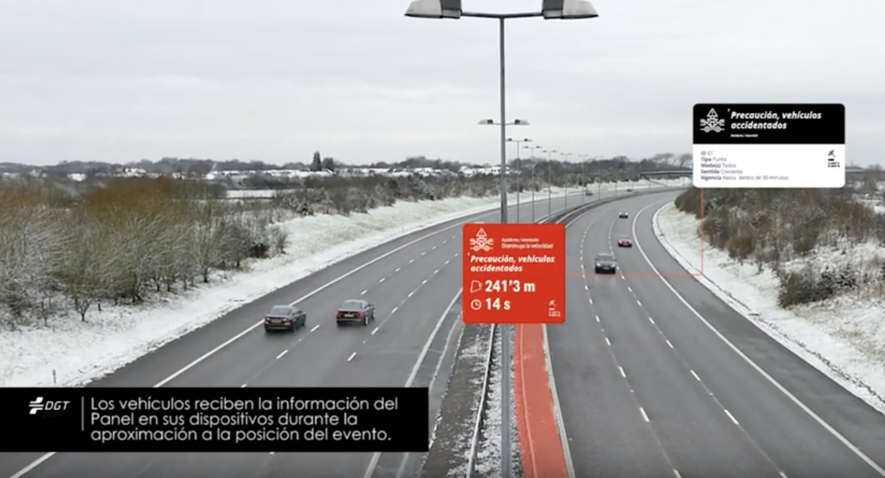

# **Workshop: Real connection tests to DGT 3.0**

Realization of integration tests assisted by the development team of the DGT 3.0 Platform.

## **Author**

| Company | Date | Version |
|:-:|:-:|:-:|
|   | 12/03/2019 | 2.0 |

## *01* **Speakers**

| Image  |  Name |  Company |Position|email|Linkedin|
|:-:|:-:|:-:|:-:|:-:|:-:|
|   | José Gómez Castaño  |    | **CTO** | jgcasta@inspide.com 	| [linkedin.com/in/josegomezcastano](https://linkedin.com/in/josegomezcastano) |

## *02* Round of **presentations** 

Initial round of presentations among all workshop attendees *"Workshop: Real connection tests to DGT 3.0"*.

## *03* **Practical** information 

 **Prerequisites**

- Room.
- Internet connection
- Individual computer equipment (PCs) and group computers (projector).
- Client Certificate.
- Access the range of IPs in the DGT 3.0 Platform.
- Knowledge of the assistants on the API manjejo in the technology of the Client.
- Signature of the administrative documentation: NDA, Responsibility about the certificate and connection, etc.

 **API Documentation 'Bandeja de Salida'**

The API information of the 'Bandeja de Salida' can be found in the following URLs [Apiary](https://bandejasalidaeng.docs.apiary.io) (Free access) and [Swagger](https://bandejadesalida-dev.cmobility30.es:8443/swagger-ui.html) (Certificate required).

 **Tools**

For the execution of the tests the use of a REST Client is necessary. The *download* of [Postman](https://www.getpostman.com/downloads/).

## *04* **Index** 

1. [Speakers](#id1)
2. [Round of presentations](#id2)
3. [Practical information](#id3)
4. [Index](#id4)
5. [Objectives](#id5)
6. [What is DGT 3.0?](#id6)
7. [Definition PMV](#id7)
8. [Ways to connect to DGT3.0](#id8)
9. [When connect to 'Bandeja de Salida'?](#id9)
10. [Testing](#id10)
11. [Frequently asked questions](#id11)
12. [Final summary](#id12)
13. [Next steps](#id13)
14. [Manufacturers information collection](#id14)

## *05* **Objectives** 

### General

Carry out detailed integration tests controlled by the development team of the DGT 3.0 platform.

### Actividades

- Explanation of DGT 3.0 project.
- Explanation of forms of connection to the DGT 3.0 Platform.
- Technical advice to the development teams in relation to the existing integration mechanisms.
- Resolution of technical and functional doubts.
- Compilation of technical information of the manufacturer.

## *06* What is **DGT 3.0**? 

|Definition |
|:-|
| The DGT 3.0 Connected Vehicle Platform is a platform that offers road safety and intelligent mobility services under the SaaS concept based on spatial information processing.|

>  **Note**
>
>
> The services described in DGT 3.0 cover all phases of the life cycle of a spatial data:
>
> - **Real-time processing** of large volumes of spatial and alphanumeric data for consumption.
> - **Spatial analysis and application of different types of logics** road safety on the Big data available to obtain KPIs.
> - **Sending road safety information** when the risk level exceeds a preset threshold.
>

## *07* Definition **PMV** 

|Definition | Reference video|
|:-|:-|
| It is a new concept that consists of virtualizing the traditional Variable Message Panels (physical) to allow the Traffic General Directorate to regulate traffic adapting it to changing traffic circumstances. They are used to give information to drivers, warn them of possible dangers and give recommendations at any point, section or area of ​​the road network| |

## *08* Ways to connect to **DGT3.0** 

|Bandeja de Salida |  Bandeja de Difusión |
|:-|:-|
|Interface used by the Client Platform for the **reception** on demand of any geo-referenced event available on the DGT 3.0 Platform at the time of the query | Interface used by the Client Platform for the **real time ** sending of specific events and / or dynamic positioning of their connected devices; and / or **real-time** reception of any geo-referenced event available on the DGT 3.0 Platform during the approach of the device to the location of the event that affects its mobility |
|In **preproduction** **currently** |  **-**  |
| **-** |  **--** |
|Documentation [**here**](https://bandejasalida.docs.apiary.io/)|  Documentation *coming soon* |

## *09* When to connect to **Bandeja de Salida?** 

|Case |  Motive |
|:-:|:-|
|1 | The Company does not wish to send information of its connected devices (App, IoT, connected vehicles, etc.) to the DGT 3.0 Platform |
|2 | The Company wishes to send traffic information (incidents, road status, etc.) to the DGT 3.0 Platform, so it must implement the necessary mechanisms in its Intelligent Mobility Platform.|
|3 | The Company wishes to receive information from the DGT 3.0 Platform, for which reason it must implement the necessary logic in its Intelligent Mobility Platform to exploit the available information and send it to the Client in the format and with the agreed frequency.|
|4 | The Company wishes to receive information from the DGT 3.0 Platform on its connected devices (App, IoT, co-connected vehicles, etc.) so it must implement the necessary logic in its Intelligent Mobility Platform to notify users in real time.|

## *10* **Testing** 

*Link* for access to practical exercises [**here**](Pruebas_ENG.md). A new window will open.

## *11* **Frequently asked questions** 

It will be completed during the workshop by the speakers.

## *12* **Final summary** 

Summary of the main ideas on the part of the speakers summarizing the lessons learned, focusing on the most discarded aspects detected during the session.

## *13* **Next steps** 

Autonomous connection testing by the manufacturer with remote assistance by the DGT 3.0 development team. This will consist of:

- Provide technical advice to the development teams of the manufacturers in terms of integration mechanisms.
- Solve technical and functional doubts.
- Simulation of real tests.
- To solve the possible errors derived from the breach of the communication standards.

## *14* **Collection of manufacturer information** 

Open session between attendees and speakers. The main objective is to obtain * feedback * from the assistants in relation to improvements on the workshop, interfaces, etc.

© 2018-2019 DGT. All rights reserved.
