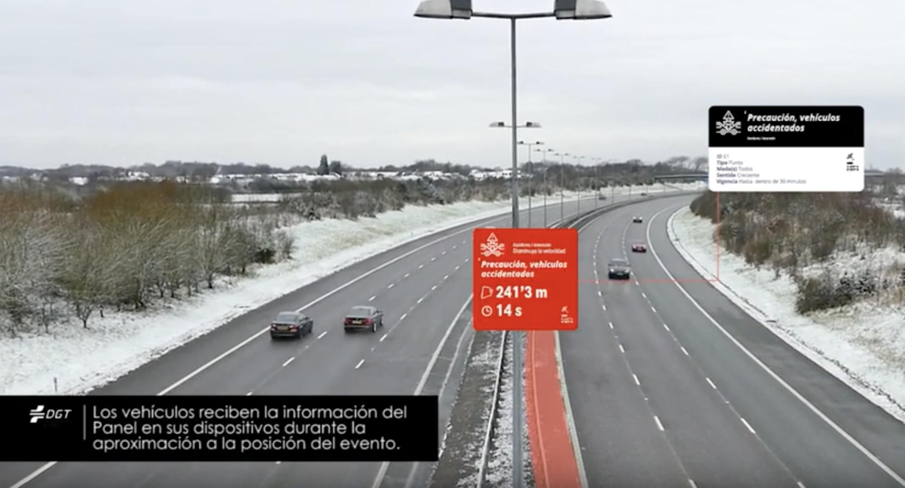

# **Workshop: Pruebas de conexión real a DGT 3.0**

Realización de pruebas de integración asistidas por el equipo de desarrollo de la Plataforma DGT 3.0.

## **Autor**

| Empresa | Fecha | Versión |
|:-:|:-:|:-:|
|   | 12/03/2019 | 2.0 |

## *01* **Ponentes**

| Imagen  |  Nombre |  Empresa |Cargo|email|Linkedin|
|:-:|:-:|:-:|:-:|:-:|:-:|
|   | José Gómez Castaño  |    | **CTO** | jgcasta@inspide.com 	| [linkedin.com/in/josegomezcastano](https://linkedin.com/in/josegomezcastano) |

## *02* Ronda de **presentaciones** 

Ronda inicial de presentaciones entre todos los asistentes al workshop *"Pruebas de conexión real a DGT 3.0"*.

## *03* Información **práctica** 

 **Requerimientos previos**

- Sala.
- Conexión a internet.
- Equipos informáticos individuales (PCs) y grupales (proyector).
- Certificado Cliente.
- Tener accesible el rango de IPs en la Plataforma DGT 3.0.
- Conocimiento de los asistentes sobre el manjejo de APIs en la tecnología del Cliente.
- Firma de la documentación administrativa: NDA, Responsabilidad sobre el certificado y conexión, etc.

 **Documentación del API Bandeja de Salida**

La información del API de la **Bandeja de Salida** se encuentra en las siguientes urls:  [Swagger](https://bandejadesalida-dev.cmobility30.es:8443/swagger-ui.html) (requerido certificado).

 **Herramientas**

Para la ejecución de las pruebas es necesario el uso de un Cliente REST. Se propone la *descarga* de [Postman](https://www.getpostman.com/downloads/) como cliente para el seguimiento del workshop.

## *04* **Índice** 

1. [Ponentes](#id1)
2. [Ronda de presentaciones](#id2)
3. [Información práctica](#id3)
4. [Índice](#id4)
5. [Objetivos](#id5)
6. [¿Qué es DGT 3.0?](#id6)
7. [Definición PMV](#id7)
8. [Formas de conexión a DGT3.0](#id8)
9. [¿Cuando conectarse a la Bandeja de Salida?](#id9)
10. [Pruebas](#id10)
11. [Preguntas frecuentes](#id11)
12. [Resumen final](#id12)
13. [Próximos pasos](#id13)
14. [Recopilación de información de fabricantes](#id14)
15. [Tablas auxiliares](#id15)

## *05* **Objetivos** 

### General

Realizar pruebas de integración detalladas controladas por el equipo de desarrollo de la plataforma DGT 3.0.

### Actividades

- Explicación proyecto DGT 3.0.
- Explicación de formas de conxión a la Plataforma DGT 3.0.
- Asesoramiento técnico a los equipos de desarrollo en relación a los mecanismos de integración existentes.
- Resolución de dudas tanto técnicas como funcionales.
- Recopilación de información técnica del fabricante.

## *06* ¿Qué es **DGT 3.0**? 

|Definición |
|:-|:-|
| La Plataforma de Vehículo Conectado DGT 3.0 es una plataforma que ofrece servicios de seguridad vial y movilidad inteligente bajo el concepto SaaS basados en el procesamiento de información espacial.|

>  **Nota**
>
>
> Los servicios expuestos en DGT 3.0 abarcan todas las fases del ciclo de vida de un dato espacial:
>
> - **Procesamiento en tiempo real** de grandes volúmenes de datos de carácter espacial y alfanumérico para su consumo.
> - **Análisis espacial y aplicación de diferentes tipos de lógicas** de seguridad vial sobre el Big data disponible para la obtención de KPIs.
> - **Envío de información de seguridad vial** cuando el nivel de riesgo supera un umbral prestablecido.
>

## *07* Definición **PMV** 

|Definición |  Video de referencia|
|:-|:-|
| Es un nuevo concepto que consiste en virtualizar los Paneles de Mensaje Variable tradicionales (físicos) para permite a la Dirección General de Tráfico regular la circulación adaptándola a las circunstancias cambiantes del tráfico. Se utilizan para dar información a los conductores, advertirles de posibles peligros y dar recomendaciones en cualquier punto, tramo o área de la red viaria.| |

## *08* Formas de conexión a **DGT3.0** 

|Bandeja de Salida |  Bandeja de Difusión |
|:-|:-|
|Interfaz utilizada por la Plataforma del Cliente para la **recepción** bajo demanda de cualquier evento georreferenciado disponible en la Plataforma DGT 3.0 en el momento de realizar la consulta |  Interfaz utilizada por la Plataforma del Cliente para el **envío** en tiempo real de eventos puntuales y/o posicionamiento dinámico de sus dispositivos conectados; y/o **recepción** en tiempo real de cualquier evento georreferenciado disponible en la Plataforma DGT 3.0 durante la aproximación del dispositivo a la ubicación del evento que incide en su movilidad |
|En **preproducción** **actualmente** |  -  |
|Documentación [**aquí**](https://bandejasalida.docs.apiary.io/)|  Documentación *próximamente* |

## *09* ¿Cuando conectarse a la **Bandeja de Salida?** 

|Caso |  Motivo |
|:-:|:-|
|1 | La Compañía no desea enviar información de sus dispositivos conectados (App, IoT, vehículos conectados, etc) a la Plataforma DGT 3.0. |
|2 | La Compañía desea enviar información de tráfico (incidencias, estado carretera, etc.) a la Plataforma DGT 3.0 por lo que debe implementar los mecanismos necesarios en su Plataforma de movilidad inteligente.|
|3 | La Compañía desea recibir información de la Plataforma DGT 3.0 por lo que debe implementar la lógica necesaria en su Plataforma de movilidad inteligente que permita explotar la información disponible y enviarla al Cliente en el formato y con la periodicidad acordada.|
|4 | La Compañía desea recibir información de la Plataforma DGT 3.0 en sus dispositivos conectados (App, IoT, vehículos coenctados, etc) por lo que debe implementar la lógica necesaria en su Plataforma de movilidad inteligente para notificar a los usuarios en tiempo real.|

## *10* **Pruebas** 

*Link* de acceso a ejercicios prácticos [**aquí**](Pruebas_ESP.md). Se abrirá una nueva ventana.

## *11* **Preguntas frecuentes** 

Se cumplimetará durante el taller por los ponentes.

## *12* **Resumen final** 

Resumen de las ideas principales por parte de los ponentes resumiendo las lecciones aprendidas incidiendo en aquellos aspectos más descatados detectados durante la sesión.

## *13* **Próximos pasos** 

Realización de pruebas autónomas de conexión por parte del fabricante con la asistencia en remoto por parte del equipo de desarrollo de DGT 3.0. Esta consistirá en:

- Prestar asesoría técnica a los equipos de desarrollo de los fabricantes en cuanto a los mecanismos de integración.
- Resolver dudas tanto técnicas como funcionales.
- Simulación de pruebas reales.
- Solucionar los posibles errores derivados del incumplimiento de los estándares de comunicación.

## *14* **Recopilación de información de fabricantes** 

Sesión abierta entre asistentes y ponentes. El objetivo principal es obtener *feedback* de los asistentes en relación a mejoras sobre el workshop, interfaces, etc.

# Tablas auxiliares 

A continuación se listan las tablas y su contenido, necesarios para la codificación y decodificación de los mensajes.

## Categoría del evento

Etiqueta del Tipo de Evento indicado por el PMV.

category|Descripción
--|--
0	|Desconocido / general
1	|Vulnerable
2	||Incidencia
3	|Obra
4	|Conservación
5	|Estado de la infraestructura
6	|Tiempos de embarque
7	|Accidente / Detenido
8	|Meteorológica
9	|Estado del tráfico
10	|Radar
11	|Obstáculo
12	|Eventos
13	|Restricción
14	|Calidad del aire
15	|Puertos
16	|Derramamiento
17	|Estado parking
18	|Obstáculo fijo
19	|Obstáculo móvil
20	|Medidas de regulación
21	|Embolsamiento
22	|Alteración capacidad
23	|Alteración carretera
24	|Malas condiciones de la carreteraModo de transporte

## Tipos de modos de transporte 

Contemplados en la plataforma y que son utilizados en el PMV para indicar qué modo de transporte está afectado por el PMV.

mode|	Descripción
--|--
1	|Bicicleta
2	|Peatón
3	|Ciclomotor / Motocicleta
4	|Tracción animal
5	|Tractor
6	|Autocaravana
7	|Turismo
8	|Furgón/furgoneta
9	|Autobús o autocar
10	|Camión

## Dirección

Atributo que indica el sentido de circulación al que aplica el PMV.

direction	|Descripción
--|--
1	|Ambos
2	|Creciente
3	|DecrecienteEventoAtributo que indica la forma de consumir la información de un 

## PMV tipo Área.

event|	Descripción
--|--
1	|Al entrar
2	|Al salirTipoTipo de PMV.

type	|Descripción
--|--
1	|Punto
2	|Tramo
3	|Área
99	|Todos

## Geometría

Se requiere o no devolución de la geometría del PMV en la respuesta

withgeom|	Descripción
--|--
1	|Si
0	|No

© 2018-2019 DGT. Todos los derechos reservados.
